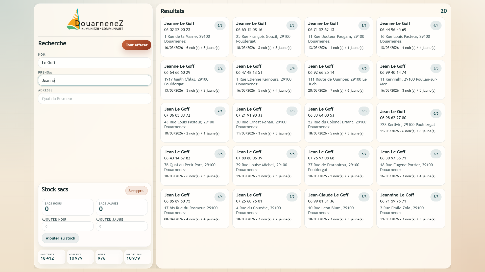
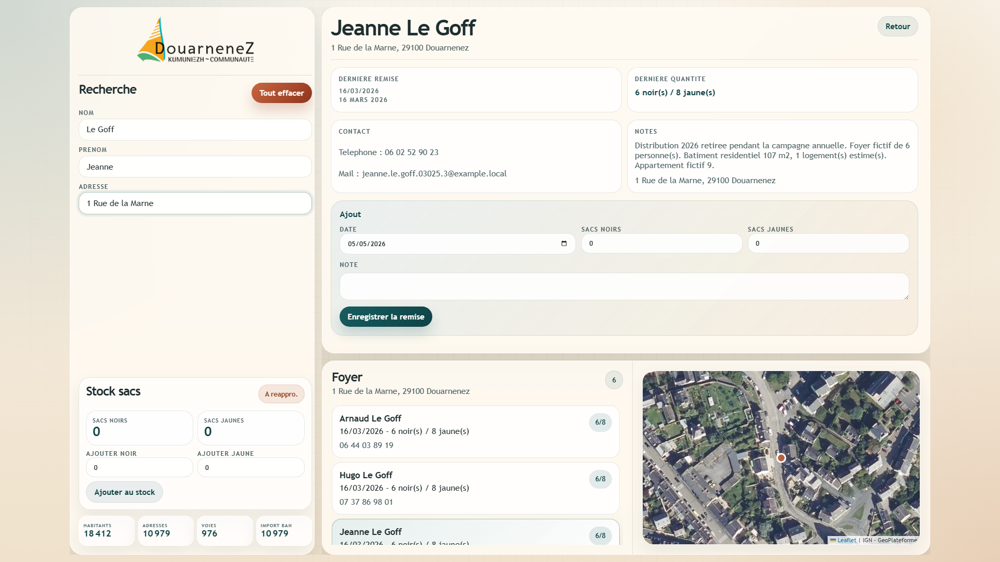

# Suivi de distribution de sacs poubelle

Application web locale pour suivre la distribution de sacs poubelle dans une commune comme Douarnenez.

Le projet combine un annuaire de foyers, une carte, un suivi des remises et des outils de preparation de donnees pour aider un service communal a distribuer, verifier et historiser plus simplement.

## Apercu

Presentation visuelle complete : [presentation-a4.html](static/presentation-a4.html)

Les captures ci-dessous reprennent les vues les plus utiles de cette presentation.

### Ecran 1 - Recherche, stock et resultats



### Ecran 2 - Fiche habitant et historique



## Ce que fait l'application

- recherche un habitant par nom, prenom ou adresse ;
- affiche les foyers et les adresses associees ;
- permet de saisir les remises de sacs noirs et jaunes ;
- conserve un historique des remises deja effectuees ;
- montre le contexte geographique avec une carte et des batiments ;
- peut fonctionner avec des donnees de demonstration et des imports prepares localement.

## Demarrage rapide

1. Initialiser la base locale :

```powershell
python outils/init_db.py
```

2. Demarrer le serveur local :

```powershell
python app.py
```

Alternative Windows :

```powershell
.\lancer_application.bat
```

3. Ouvrir ensuite :

```text
http://127.0.0.1:8000
```

## Outils

Generation rapide d'habitants fictifs :

```powershell
python outils/generate_fake_residents.py --force --households 12
```

Import des adresses publiques BAN de Douarnenez :

```powershell
python outils/import_ban_addresses.py --city-code 29046 --department 29 --city-name Douarnenez
```

Le script d'import enregistre un apercu JSON dans `outils/data/douarnenez_addresses_preview.json`.

Wrappers Windows disponibles dans `outils/` :

- `outils/regenerer_habitants_realistes.bat`
- `outils/mettre_a_jour_cache_carte.bat`
- `outils/mettre_a_jour_cache_tuiles_satellite.bat`

## Executable Windows

Le projet peut etre empaquete avec PyInstaller :

```powershell
pyinstaller suivi_distribution_sacs.spec
```

Le build s'appuie sur :

- `launcher.py` comme point d'entree de l'application a empaqueter ;
- `runtime_paths.py` pour resoudre les chemins en mode source ou en mode executable ;
- `suivi_distribution_sacs.spec` pour declarer les ressources embarquees.

L'executable genere se trouve ensuite dans :

```text
dist\SuiviDistributionSacs.exe
```

Au premier lancement, l'executable cree son propre dossier `data` a cote du `.exe`, initialise la base si besoin, puis ouvre l'application dans le navigateur.

## Organisation du depot

- `app.py` : serveur HTTP local et API JSON
- `database.py` : schema SQLite, donnees de demo et fonctions de seed
- `launcher.py` : point d'entree minimal pour le lancement et l'empaquetage
- `runtime_paths.py` : gestion des chemins en mode developpement et PyInstaller
- `static/` : interface HTML/CSS/JS et captures de presentation
- `data/` : donnees de reference utilisees directement par l'application
- `outils/` : scripts utilitaires, wrappers Windows et outillage de preparation
- `outils/data/` : caches, apercus et jeux de donnees lies aux scripts d'outillage

## Fichiers generes localement

Ne sont pas pousses sur GitHub :

- `build/` et `dist/` pour les builds PyInstaller ;
- les bases SQLite locales dans `data/` ;
- les caches de tuiles, profils headless Chrome et dossiers `__pycache__/`.

## Donnees publiques

La carte utilise les services publics de l'IGN quand ils repondent :

- Plan IGN WMTS
- Parcellaire cadastral WMTS
- Batiments via WFS GeoPlateforme

Si les services cartographiques distants sont indisponibles, l'application bascule sur un mode local de demonstration avec des batiments simplifies.

## Sources publiques retenues

- La Base Adresse Nationale est le referentiel officiel des adresses : https://adresse.data.gouv.fr/decouvrir-la-BAN
- La page commune Douarnenez BAN : https://adresse.data.gouv.fr/commune/29046
- Le service de geocodage GeoPlateforme : https://cartes.gouv.fr/aide/fr/guides-utilisateur/utiliser-les-services-de-la-geoplateforme/geocodage/
- Les services WMTS GeoPlateforme : https://cartes.gouv.fr/aide/fr/guides-utilisateur/utiliser-les-services-de-la-geoplateforme/diffusion/wmts/
- Les services WFS GeoPlateforme : https://cartes.gouv.fr/aide/fr/guides-utilisateur/utiliser-les-services-de-la-geoplateforme/diffusion/wfs/

## Suite logique de deploiement

- preparer un script de conversion des habitants reels vers un format compatible avec l'application ;
- preparer aussi le chemin inverse pour exporter les donnees saisies vers un format exploitable par la collectivite ;
- adapter les scripts d'import et de generation aux donnees reelles disponibles sur le terrain ;
- verifier la qualite des correspondances entre habitants, adresses, foyers et batiments ;
- definir un processus simple de mise a jour des donnees avant chaque nouvelle annee de distribution ;
- ajouter une regle claire pour gerer le retrait annuel de sacs par habitant ou par foyer ;
- conserver un historique des remises avec date, volume et agent declarant pour savoir si le retrait annuel a deja eu lieu ;
- stabiliser un mode de deploiement poste par poste ou via un executable Windows pour les agents.

## Ameliorations possibles

- ajouter une recherche par numero de telephone ;
- ajouter une recherche multi-criteres plus fine par nom, adresse, foyer ou commentaire ;
- envoyer une notification mail automatique quand le stock de sacs devient faible ;
- proposer des alertes sur les incoherences de distribution ou les doublons potentiels ;
- ajouter des exports CSV ou Excel pour le suivi annuel des remises ;
- afficher plus clairement si un habitant ou un foyer a deja retire ses sacs pour l'annee en cours ;
- ajouter une authentification simple avec journal des actions ;
- prevoir une interface plus adaptee a un usage tablette ou accueil guichet ;
- enrichir la fiche foyer avec des remarques, justificatifs ou statuts de passage ;
- brancher des integrations mail ou metier pour fluidifier le suivi operationnel.
